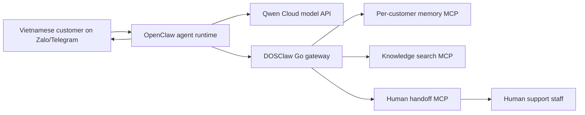

# Devpost Draft: Huyen Qwen Cloud Autopilot

## Title

Huyen: A Qwen-powered Vietnamese SME Support Autopilot

## Tagline

Persistent customer memory, live knowledge lookup, and honest human handoff for Vietnamese small businesses.

## Track

Primary: Track 4, Autopilot Agent

Secondary fit: Track 1, MemoryAgent

## What It Does

Huyen is an AI support agent for Vietnamese small businesses. It answers customer questions from a live knowledge base, remembers customer-specific preferences across sessions, and escalates risky or unresolved cases to a real staff member through a structured handoff tool.

The demo shows three core workflows:

1. A returning customer asks a product question and Huyen recalls their saved delivery preference.
2. A customer asks about warranty or return policy and Huyen searches the business knowledge base before answering.
3. A customer complains or asks for a refund and Huyen calls the human handoff tool before confirming escalation.

## How Qwen Cloud Is Used

Qwen Cloud powers the primary agent reasoning and response path through the OpenAI-compatible DashScope endpoint:

```text
https://dashscope-intl.aliyuncs.com/compatible-mode/v1
```

OpenClaw is the runtime and channel orchestrator. DOSClaw injects a `qwen-cloud` OpenAI-compatible provider into the OpenClaw config for opt-in submission agents and sets `qwen-cloud/<model>` as the primary model.

The public demo API also includes a live Qwen Cloud adapter. When `QWEN_CLOUD_API_KEY` or `DASHSCOPE_API_KEY` is configured, `/api/demo` sends the selected scenario and tool evidence to Qwen Cloud Chat Completions. Without a key, it returns the same synthetic fallback payload so the public repository remains buildable by judges without secrets.

## Architecture



## Why It Matters

Vietnamese SMEs often run support through chat channels and informal staff handoff. Generic chatbots fail because they forget repeat customers, guess business facts, or falsely promise that a staff member was notified. Huyen focuses on production-grade support behavior: grounded answers, persistent customer memory, and honest escalation.

## Built With

- Qwen Cloud OpenAI-compatible API
- Alibaba Cloud deployment target
- OpenClaw
- DOSClaw Go API gateway
- Supabase/Postgres
- Zalo/Telegram channels
- MCP tools for memory, knowledge, and handoff

## Links

- Source code: `https://github.com/JOY/huyen-qwen-cloud`
- Qwen Cloud provider contract: `https://github.com/JOY/huyen-qwen-cloud/blob/main/docs/huyen-agent-config.md`
- Live Qwen Cloud adapter: `https://github.com/JOY/huyen-qwen-cloud/blob/main/src/lib/qwen.ts`
- Demo API: `https://github.com/JOY/huyen-qwen-cloud/blob/main/src/app/api/demo/route.ts`
- Blog draft: `https://github.com/JOY/huyen-qwen-cloud/blob/main/docs/blog-post-draft.md`
- Social post draft: `https://github.com/JOY/huyen-qwen-cloud/blob/main/docs/social-post-draft.md`

## Submission Checklist

- Public source repository with open source license.
- Proof that backend is running on Alibaba Cloud.
- Code link showing Qwen Cloud / Alibaba Cloud API usage.
- Architecture diagram.
- 3-minute demo video.
- No production secrets or private customer data in the public repo.
